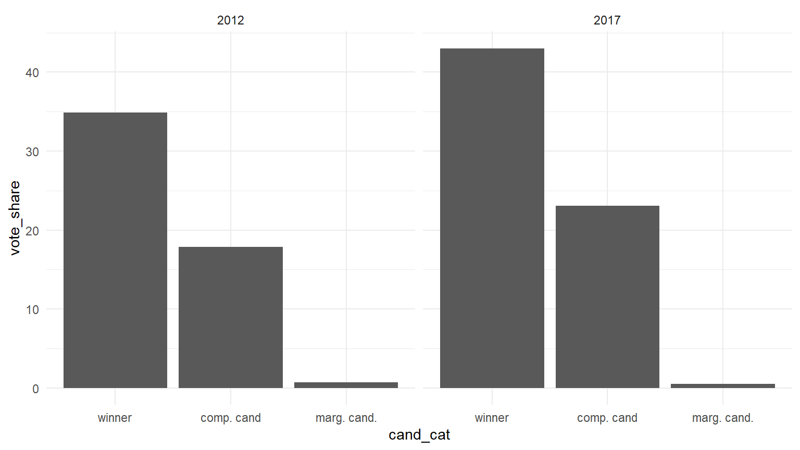
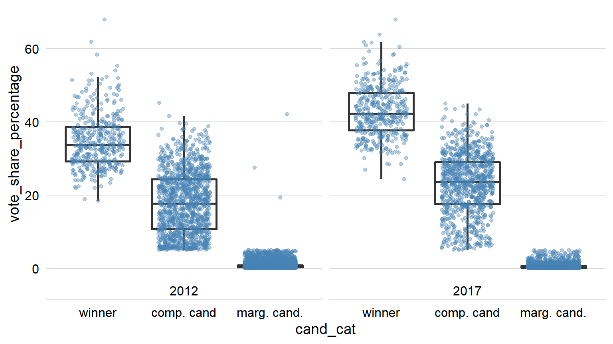
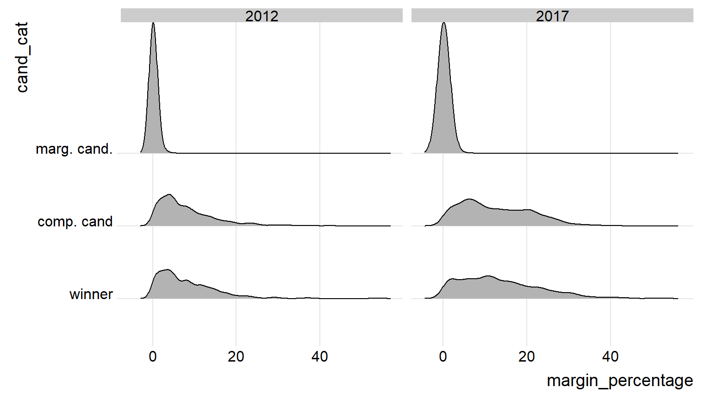

The purpose of this analysis to understand how the electoral, economic, criminal and other relevant characteristics vary according to the electoral performance. We have classified candidates into three categories based on their electoral performance. Those categories are as follows:

- Winner candidate - The candidate who have received the maximum percentage of vote share.

- Competitive candidate - Candidates who have received at least five percentage or more vote share.

- Marginal candidates - Candidates who have received a minuscule share of vote share ie. less than 5 percentage of the vote share.


# Post delimitation

## AE


The 2017 elecion in uttar Pradesh witnessed 5231 candidates running from 403 assembly constituencies. Among them 17%  and 75% of the candidates were competitive and marginal candidates respectively. The previous election, in which 6532 candidates contested was no different from this except for the one percent rise in the competitive candidates., proportion. 


### Vote share







### Margin




```
## <ggproto object: Class ScaleDiscrete, Scale, gg>
##     aesthetics: fill
##     axis_order: function
##     break_info: function
##     break_positions: function
##     breaks: waiver
##     call: call
##     clone: function
##     dimension: function
##     drop: TRUE
##     expand: waiver
##     get_breaks: function
##     get_breaks_minor: function
##     get_labels: function
##     get_limits: function
##     guide: legend
##     is_discrete: function
##     is_empty: function
##     labels: waiver
##     limits: NULL
##     make_sec_title: function
##     make_title: function
##     map: function
##     map_df: function
##     n.breaks.cache: NULL
##     na.translate: TRUE
##     na.value: NA
##     name: waiver
##     palette: function
##     palette.cache: NULL
##     position: left
##     range: <ggproto object: Class RangeDiscrete, Range, gg>
##         range: NULL
##         reset: function
##         train: function
##         super:  <ggproto object: Class RangeDiscrete, Range, gg>
##     rescale: function
##     reset: function
##     scale_name: viridis_d
##     train: function
##     train_df: function
##     transform: function
##     transform_df: function
##     super:  <ggproto object: Class ScaleDiscrete, Scale, gg>
```

```
## geom_density: na.rm = FALSE, orientation = NA, outline.type = upper
## stat_density: na.rm = FALSE, orientation = NA
## position_identity
```


## Results {.tabset}

### Plots

We show a scatter plot in this section.


### Tables

We show the data in this tab.


```
##                    mpg cyl disp  hp drat    wt  qsec vs am gear carb
## Mazda RX4         21.0   6  160 110 3.90 2.620 16.46  0  1    4    4
## Mazda RX4 Wag     21.0   6  160 110 3.90 2.875 17.02  0  1    4    4
## Datsun 710        22.8   4  108  93 3.85 2.320 18.61  1  1    4    1
## Hornet 4 Drive    21.4   6  258 110 3.08 3.215 19.44  1  0    3    1
## Hornet Sportabout 18.7   8  360 175 3.15 3.440 17.02  0  0    3    2
## Valiant           18.1   6  225 105 2.76 3.460 20.22  1  0    3    1
```
