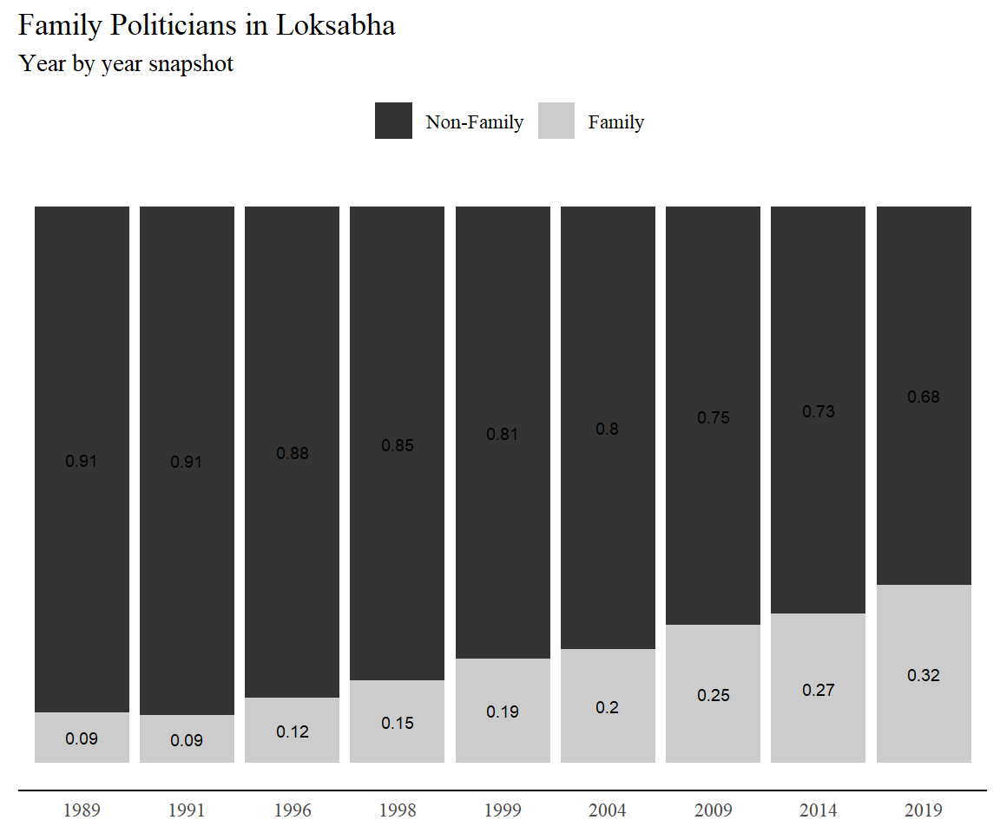
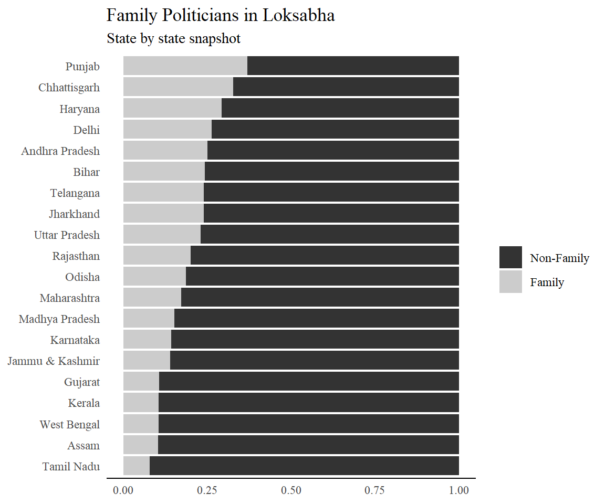

---

### Document History

Original Publish Date: 18 August, 2021

Updated on: 10:08  AM -- 19 August, 2021

---

# Preliminary analysis {.tabset}

## Data summary

+----+-------------------------+----------------------------------+-----------------------+----------------------+----------+
| No | Variable                | Stats / Values                   | Freqs (% of Valid)    | Graph                | Missing  |
+====+=========================+==================================+=======================+======================+==========+
| 1  | state_name\             | 1\. Uttar Pradesh\               | 2648 (18.9%)\         |  | 0\       |
|    | [character]             | 2\. Bihar\                       | 1293 ( 9.2%)\         |                      | (0.0%)   |
|    |                         | 3\. Maharashtra\                 | 1181 ( 8.4%)\         |                      |          |
|    |                         | 4\. West Bengal\                 | 1090 ( 7.8%)\         |                      |          |
|    |                         | 5\. Tamil Nadu\                  | 982 ( 7.0%)\          |                      |          |
|    |                         | 6\. Andhra Pradesh\              | 834 ( 5.9%)\          |                      |          |
|    |                         | 7\. Madhya Pradesh\              | 818 ( 5.8%)\          |                      |          |
|    |                         | 8\. Karnataka\                   | 726 ( 5.2%)\          |                      |          |
|    |                         | 9\. Rajasthan\                   | 534 ( 3.8%)\          |                      |          |
|    |                         | 10\. Gujarat\                    | 524 ( 3.7%)\          |                      |          |
|    |                         | [ 26 others ]                    | 3388 (24.2%)          |                      |          |
+----+-------------------------+----------------------------------+-----------------------+----------------------+----------+
| 2  | year\                   | Mean (sd) : 2002 (9.4)\          | 1989 : 1394 ( 9.9%)\  |  | 0\       |
|    | [integer]               | min < med < max:\                | 1991 : 1613 (11.5%)\  |                      | (0.0%)   |
|    |                         | 1989 < 1999 < 2019\              | 1996 : 1733 (12.4%)\  |                      |          |
|    |                         | IQR (CV) : 13 (0)                | 1998 : 1584 (11.3%)\  |                      |          |
|    |                         |                                  | 1999 : 1538 (11.0%)\  |                      |          |
|    |                         |                                  | 2004 : 1525 (10.9%)\  |                      |          |
|    |                         |                                  | 2009 : 1659 (11.8%)\  |                      |          |
|    |                         |                                  | 2014 : 1602 (11.4%)\  |                      |          |
|    |                         |                                  | 2019 : 1370 ( 9.8%)   |                      |          |
+----+-------------------------+----------------------------------+-----------------------+----------------------+----------+
| 3  | constituency_no\        | Mean (sd) : 21 (18.3)\           | 85 distinct values    |  | 0\       |
|    | [integer]               | min < med < max:\                |                       |                      | (0.0%)   |
|    |                         | 1 < 16 < 85\                     |                       |                      |          |
|    |                         | IQR (CV) : 24 (0.9)              |                       |                      |          |
+----+-------------------------+----------------------------------+-----------------------+----------------------+----------+
| 4  | position\               | Mean (sd) : 2.1 (1)\             | 1 : 4849 (34.6%)\     |  | 0\       |
|    | [integer]               | min < med < max:\                | 2 : 4846 (34.6%)\     |                      | (0.0%)   |
|    |                         | 1 < 2 < 9\                       | 3 : 3169 (22.6%)\     |                      |          |
|    |                         | IQR (CV) : 2 (0.5)               | 4 :  948 ( 6.8%)\     |                      |          |
|    |                         |                                  | 5 :  187 ( 1.3%)\     |                      |          |
|    |                         |                                  | 6 :   13 ( 0.1%)\     |                      |          |
|    |                         |                                  | 7 :    4 ( 0.0%)\     |                      |          |
|    |                         |                                  | 8 :    1 ( 0.0%)\     |                      |          |
|    |                         |                                  | 9 :    1 ( 0.0%)      |                      |          |
+----+-------------------------+----------------------------------+-----------------------+----------------------+----------+
| 5  | caste_rec\              | 1\. (Empty string)\              | 6620 (55.9%)\         |  | 2169\    |
|    | [character]             | 2\. UC\                          | 1455 (12.3%)\         |                      | (15.5%)  |
|    |                         | 3\. OBC\                         | 1143 ( 9.6%)\         |                      |          |
|    |                         | 4\. SC\                          | 869 ( 7.3%)\          |                      |          |
|    |                         | 5\. IC\                          | 550 ( 4.6%)\          |                      |          |
|    |                         | 6\. ST\                          | 493 ( 4.2%)\          |                      |          |
|    |                         | 7\. MUSLIM\                      | 377 ( 3.2%)\          |                      |          |
|    |                         | 8\. UC MUSLIM\                   | 72 ( 0.6%)\           |                      |          |
|    |                         | 9\. IC SIKH\                     | 62 ( 0.5%)\           |                      |          |
|    |                         | 10\. GEN\                        | 45 ( 0.4%)\           |                      |          |
|    |                         | [ 22 others ]                    | 163 ( 1.4%)           |                      |          |
+----+-------------------------+----------------------------------+-----------------------+----------------------+----------+
| 6  | dyn\                    | 1\. (Empty string)\              | 4741 (33.8%)\         |  | 0\       |
|    | [character]             | 2\. 0\                           | 6673 (47.6%)\         |                      | (0.0%)   |
|    |                         | 3\. 1\                           | 2573 (18.4%)\         |                      |          |
|    |                         | 4\. Recheck                      | 31 ( 0.2%)            |                      |          |
+----+-------------------------+----------------------------------+-----------------------+----------------------+----------+
| 7  | source\                 | 1\. (Empty string)\              | 4839 (34.5%)\         |  | 0\       |
|    | [character]             | 2\. TALHA\                       | 3372 (24.1%)\         |                      | (0.0%)   |
|    |                         | 3\. Patrick French\              | 1008 ( 7.2%)\         |                      |          |
|    |                         | 4\. Not Known\                   | 714 ( 5.1%)\          |                      |          |
|    |                         | 5\. Arun\                        | 526 ( 3.8%)\          |                      |          |
|    |                         | 6\. Walru\                       | 393 ( 2.8%)\          |                      |          |
|    |                         | 7\. Rama\                        | 328 ( 2.3%)\          |                      |          |
|    |                         | 8\. Rakesh\                      | 261 ( 1.9%)\          |                      |          |
|    |                         | 9\. Somnath\                     | 198 ( 1.4%)\          |                      |          |
|    |                         | 10\. TCPD\                       | 193 ( 1.4%)\          |                      |          |
|    |                         | [ 40 others ]                    | 2186 (15.6%)          |                      |          |
+----+-------------------------+----------------------------------+-----------------------+----------------------+----------+
| 8  | background\             | 1\. (Empty string)\              | 4737 (33.8%)\         |  | 2\       |
|    | [character]             | 2\. No significant political \   | 3012 (21.5%)\         |                      | (0.0%)   |
|    |                         | 3\. No significant family bac\   | 1560 (11.1%)\         |                      |          |
|    |                         | 4\. Family - Son\                | 206 ( 1.5%)\          |                      |          |
|    |                         | 5\. Student politics\            | 168 ( 1.2%)\          |                      |          |
|    |                         | 6\. Business\                    | 157 ( 1.1%)\          |                      |          |
|    |                         | 7\. Family\                      | 130 ( 0.9%)\          |                      |          |
|    |                         | 8\. Family - Multiple connect\   | 89 ( 0.6%)\           |                      |          |
|    |                         | 9\. RSS\                         | 89 ( 0.6%)\           |                      |          |
|    |                         | 10\. Student Leader\             | 68 ( 0.5%)\           |                      |          |
|    |                         | [ 1377 others ]                  | 3800 (27.1%)          |                      |          |
+----+-------------------------+----------------------------------+-----------------------+----------------------+----------+
| 9  | notes\                  | 1\. (Empty string)\              | 9941 (70.9%)\         |  | 1\       |
|    | [character]             | 2\. Hindutva Movment\            | 35 ( 0.2%)\           |                      | (0.0%)   |
|    |                         | 3\. Buisness\                    | 22 ( 0.2%)\           |                      |          |
|    |                         | 4\. Trible Network\              | 17 ( 0.1%)\           |                      |          |
|    |                         | 5\. Wealthy businessman with \   | 17 ( 0.1%)\           |                      |          |
|    |                         | 6\. Former MP\                   | 15 ( 0.1%)\           |                      |          |
|    |                         | 7\. Movment\                     | 13 ( 0.1%)\           |                      |          |
|    |                         | 8\. Former MLA\                  | 11 ( 0.1%)\           |                      |          |
|    |                         | 9\. He is from Ambedkar famil\   | 10 ( 0.1%)\           |                      |          |
|    |                         | 10\. He started his political \  | 10 ( 0.1%)\           |                      |          |
|    |                         | [ 1686 others ]                  | 3926 (28.0%)          |                      |          |
+----+-------------------------+----------------------------------+-----------------------+----------------------+----------+
| 10 | election_type\          | 1\. GE                           | 14018 (100.0%)        |  | 0\       |
|    | [character]             |                                  |                       |                      | (0.0%)   |
+----+-------------------------+----------------------------------+-----------------------+----------------------+----------+
| 11 | assembly_no\            | Mean (sd) : 13 (2.5)\            | 9 : 1394 ( 9.9%)\     |  | 0\       |
|    | [integer]               | min < med < max:\                | 10 : 1613 (11.5%)\    |                      | (0.0%)   |
|    |                         | 9 < 13 < 17\                     | 11 : 1733 (12.4%)\    |                      |          |
|    |                         | IQR (CV) : 4 (0.2)               | 12 : 1584 (11.3%)\    |                      |          |
|    |                         |                                  | 13 : 1538 (11.0%)\    |                      |          |
|    |                         |                                  | 14 : 1525 (10.9%)\    |                      |          |
|    |                         |                                  | 15 : 1659 (11.8%)\    |                      |          |
|    |                         |                                  | 16 : 1602 (11.4%)\    |                      |          |
|    |                         |                                  | 17 : 1370 ( 9.8%)     |                      |          |
+----+-------------------------+----------------------------------+-----------------------+----------------------+----------+
| 12 | month\                  | Mean (sd) : 5.2 (2.5)\           | 3 : 1584 (11.3%)\     |  | 0\       |
|    | [integer]               | min < med < max:\                | 4 : 7889 (56.3%)\     |                      | (0.0%)   |
|    |                         | 3 < 4 < 11\                      | 5 : 1613 (11.5%)\     |                      |          |
|    |                         | IQR (CV) : 1 (0.5)               | 9 : 1538 (11.0%)\     |                      |          |
|    |                         |                                  | 11 : 1394 ( 9.9%)     |                      |          |
+----+-------------------------+----------------------------------+-----------------------+----------------------+----------+
| 13 | poll_no\                | 1 distinct value                 | 0 : 14018 (100.0%)    |  | 0\       |
|    | [integer]               |                                  |                       |                      | (0.0%)   |
+----+-------------------------+----------------------------------+-----------------------+----------------------+----------+
| 14 | delimid\                | Min  : 3\                        | 3 : 9387 (67.0%)\     |  | 0\       |
|    | [integer]               | Mean : 3.3\                      | 4 : 4631 (33.0%)      |                      | (0.0%)   |
|    |                         | Max  : 4                         |                       |                      |          |
+----+-------------------------+----------------------------------+-----------------------+----------------------+----------+
| 15 | candidate\              | 1\. RAM SINGH\                   | 9 ( 0.1%)\            |  | 0\       |
|    | [character]             | 2\. DELKAR MOHANBHAI SANJIBHA\   | 8 ( 0.1%)\            |                      | (0.0%)   |
|    |                         | 3\. DEVENDRA PRASAD YADAV\       | 8 ( 0.1%)\            |                      |          |
|    |                         | 4\. HARSH VARDHAN\               | 8 ( 0.1%)\            |                      |          |
|    |                         | 5\. MANVENDRA SINGH\             | 8 ( 0.1%)\            |                      |          |
|    |                         | 6\. RADHA MOHAN SINGH\           | 8 ( 0.1%)\            |                      |          |
|    |                         | 7\. SHARAD YADAV\                | 8 ( 0.1%)\            |                      |          |
|    |                         | 8\. AJIT SINGH\                  | 7 ( 0.0%)\            |                      |          |
|    |                         | 9\. AVTAR SINGH BHADANA\         | 7 ( 0.0%)\            |                      |          |
|    |                         | 10\. BHAKTA CHARAN DAS\          | 7 ( 0.0%)\            |                      |          |
|    |                         | [ 11371 others ]                 | 13940 (99.4%)         |                      |          |
+----+-------------------------+----------------------------------+-----------------------+----------------------+----------+
| 16 | sex\                    | 1\. F\                           | 1190 ( 8.5%)\         |  | 0\       |
|    | [character]             | 2\. M                            | 12828 (91.5%)         |                      | (0.0%)   |
+----+-------------------------+----------------------------------+-----------------------+----------------------+----------+
| 17 | party\                  | 1\. INC\                         | 3789 (27.0%)\         |  | 0\       |
|    | [character]             | 2\. BJP\                         | 3201 (22.8%)\         |                      | (0.0%)   |
|    |                         | 3\. BSP\                         | 921 ( 6.6%)\          |                      |          |
|    |                         | 4\. JD\                          | 694 ( 5.0%)\          |                      |          |
|    |                         | 5\. SP\                          | 532 ( 3.8%)\          |                      |          |
|    |                         | 6\. CPM\                         | 518 ( 3.7%)\          |                      |          |
|    |                         | 7\. IND\                         | 435 ( 3.1%)\          |                      |          |
|    |                         | 8\. TDP\                         | 292 ( 2.1%)\          |                      |          |
|    |                         | 9\. CPI\                         | 223 ( 1.6%)\          |                      |          |
|    |                         | 10\. DMK\                        | 213 ( 1.5%)\          |                      |          |
|    |                         | [ 225 others ]                   | 3200 (22.8%)          |                      |          |
+----+-------------------------+----------------------------------+-----------------------+----------------------+----------+
| 18 | votes\                  | Mean (sd) : 242837.2 (155936.2)\ | 13842 distinct values |  | 0\       |
|    | [integer]               | min < med < max:\                |                       |                      | (0.0%)   |
|    |                         | 2626 < 222973 < 1068569\         |                       |                      |          |
|    |                         | IQR (CV) : 219751 (0.6)          |                       |                      |          |
+----+-------------------------+----------------------------------+-----------------------+----------------------+----------+
| 19 | candidate_type\         | 1\. (Empty string)\              | 5531 (39.5%)\         |  | 0\       |
|    | [character]             | 2\. GEN\                         | 6208 (44.3%)\         |                      | (0.0%)   |
|    |                         | 3\. SC\                          | 1424 (10.2%)\         |                      |          |
|    |                         | 4\. ST                           | 855 ( 6.1%)           |                      |          |
+----+-------------------------+----------------------------------+-----------------------+----------------------+----------+
| 20 | valid_votes\            | Mean (sd) : 737270.7 (254449.2)\ | 4833 distinct values  |  | 0\       |
|    | [integer]               | min < med < max:\                |                       |                      | (0.0%)   |
|    |                         | 25321 < 700515 < 1763757\        |                       |                      |          |
|    |                         | IQR (CV) : 304196 (0.3)          |                       |                      |          |
+----+-------------------------+----------------------------------+-----------------------+----------------------+----------+
| 21 | electors\               | Mean (sd) : 1221058 (339630.7)\  | 4834 distinct values  |  | 0\       |
|    | [integer]               | min < med < max:\                |                       |                      | (0.0%)   |
|    |                         | 30069 < 1161808 < 3368399\       |                       |                      |          |
|    |                         | IQR (CV) : 412510 (0.3)          |                       |                      |          |
+----+-------------------------+----------------------------------+-----------------------+----------------------+----------+
| 22 | constituency_name\      | 1\. MAHARAJGANJ\                 | 60 ( 0.4%)\           |  | 0\       |
|    | [character]             | 2\. AURANGABAD\                  | 55 ( 0.4%)\           |                      | (0.0%)   |
|    |                         | 3\. HAMIRPUR\                    | 53 ( 0.4%)\           |                      |          |
|    |                         | 4\. OUTER MANIPUR\               | 38 ( 0.3%)\           |                      |          |
|    |                         | 5\. PRATAPGARH\                  | 38 ( 0.3%)\           |                      |          |
|    |                         | 6\. FARRUKHABAD\                 | 37 ( 0.3%)\           |                      |          |
|    |                         | 7\. JHANSI\                      | 37 ( 0.3%)\           |                      |          |
|    |                         | 8\. VARANASI\                    | 37 ( 0.3%)\           |                      |          |
|    |                         | 9\. BUXAR\                       | 36 ( 0.3%)\           |                      |          |
|    |                         | 10\. ROBERTSGANJ\                | 36 ( 0.3%)\           |                      |          |
|    |                         | [ 712 others ]                   | 13591 (97.0%)         |                      |          |
+----+-------------------------+----------------------------------+-----------------------+----------------------+----------+
| 23 | constituency_type\      | 1\. GEN\                         | 10823 (77.2%)\        |  | 0\       |
|    | [character]             | 2\. SC\                          | 2108 (15.0%)\         |                      | (0.0%)   |
|    |                         | 3\. ST                           | 1087 ( 7.8%)          |                      |          |
+----+-------------------------+----------------------------------+-----------------------+----------------------+----------+
| 24 | sub_region\             | 1\. (Empty string)\              | 12871 (91.8%)\        |  | 0\       |
|    | [character]             | 2\. AVADH\                       | 137 ( 1.0%)\          |                      | (0.0%)   |
|    |                         | 3\. BUNDELKHAND\                 | 44 ( 0.3%)\           |                      |          |
|    |                         | 4\. DOAB\                        | 132 ( 0.9%)\          |                      |          |
|    |                         | 5\. EAST\                        | 158 ( 1.1%)\          |                      |          |
|    |                         | 6\. NORTH-EAST\                  | 126 ( 0.9%)\          |                      |          |
|    |                         | 7\. RUHELKHAND\                  | 112 ( 0.8%)\          |                      |          |
|    |                         | 8\. SEEMANDHRA\                  | 189 ( 1.3%)\          |                      |          |
|    |                         | 9\. TELENGANA\                   | 171 ( 1.2%)\          |                      |          |
|    |                         | 10\. WEST                        | 78 ( 0.6%)            |                      |          |
+----+-------------------------+----------------------------------+-----------------------+----------------------+----------+
| 25 | n_cand\                 | Mean (sd) : 14.6 (13.7)\         | 78 distinct values    |  | 0\       |
|    | [integer]               | min < med < max:\                |                       |                      | (0.0%)   |
|    |                         | 2 < 12 < 480\                    |                       |                      |          |
|    |                         | IQR (CV) : 9 (0.9)               |                       |                      |          |
+----+-------------------------+----------------------------------+-----------------------+----------------------+----------+
| 26 | turnout_percentage\     | Mean (sd) : 60.4 (12.2)\         | 2967 distinct values  |  | 0\       |
|    | [numeric]               | min < med < max:\                |                       |                      | (0.0%)   |
|    |                         | 5 < 60.1 < 91.7\                 |                       |                      |          |
|    |                         | IQR (CV) : 17.8 (0.2)            |                       |                      |          |
+----+-------------------------+----------------------------------+-----------------------+----------------------+----------+
| 27 | vote_share_percentage\  | Mean (sd) : 32.6 (15.9)\         | 5182 distinct values  |  | 0\       |
|    | [numeric]               | min < med < max:\                |                       |                      | (0.0%)   |
|    |                         | 5 < 34.4 < 97.7\                 |                       |                      |          |
|    |                         | IQR (CV) : 25.7 (0.5)            |                       |                      |          |
+----+-------------------------+----------------------------------+-----------------------+----------------------+----------+
| 28 | deposit_lost\           | 1\. no\                          | 10947 (78.1%)\        |  | 0\       |
|    | [character]             | 2\. yes                          | 3071 (21.9%)          |                      | (0.0%)   |
+----+-------------------------+----------------------------------+-----------------------+----------------------+----------+
| 29 | margin\                 | Mean (sd) : 117974.7 (109671.8)\ | 13582 distinct values |  | 0\       |
|    | [integer]               | min < med < max:\                |                       |                      | (0.0%)   |
|    |                         | 0 < 80918 < 712215\              |                       |                      |          |
|    |                         | IQR (CV) : 135790.5 (0.9)        |                       |                      |          |
+----+-------------------------+----------------------------------+-----------------------+----------------------+----------+
| 30 | margin_percentage\      | Mean (sd) : 15.7 (12.6)\         | 4139 distinct values  |  | 0\       |
|    | [numeric]               | min < med < max:\                |                       |                      | (0.0%)   |
|    |                         | 0 < 12 < 97.2\                   |                       |                      |          |
|    |                         | IQR (CV) : 18.4 (0.8)            |                       |                      |          |
+----+-------------------------+----------------------------------+-----------------------+----------------------+----------+
| 31 | enop\                   | Mean (sd) : 3 (0.8)\             | 63 distinct values    |  | 0\       |
|    | [numeric]               | min < med < max:\                |                       |                      | (0.0%)   |
|    |                         | 1 < 2.8 < 10\                    |                       |                      |          |
|    |                         | IQR (CV) : 1 (0.3)               |                       |                      |          |
+----+-------------------------+----------------------------------+-----------------------+----------------------+----------+
| 32 | pid\                    | 1\. GEAP30917\                   | 13 ( 0.1%)\           |  | 0\       |
|    | [character]             | 2\. GEAP81781\                   | 13 ( 0.1%)\           |                      | (0.0%)   |
|    |                         | 3\. GEAP30298\                   | 11 ( 0.1%)\           |                      |          |
|    |                         | 4\. GEAP30928\                   | 11 ( 0.1%)\           |                      |          |
|    |                         | 5\. GEAP50659\                   | 11 ( 0.1%)\           |                      |          |
|    |                         | 6\. GEAP50805\                   | 11 ( 0.1%)\           |                      |          |
|    |                         | 7\. GEBR42656\                   | 10 ( 0.1%)\           |                      |          |
|    |                         | 8\. AEUP153597\                  | 9 ( 0.1%)\            |                      |          |
|    |                         | 9\. GEAP64985\                   | 9 ( 0.1%)\            |                      |          |
|    |                         | 10\. GEBR22819\                  | 9 ( 0.1%)\            |                      |          |
|    |                         | [ 8147 others ]                  | 13911 (99.2%)         |                      |          |
+----+-------------------------+----------------------------------+-----------------------+----------------------+----------+
| 33 | party_type_tcpd\        | All NA's                         |                       |                      | 14018\   |
|    | [logical]               |                                  |                       |                      | (100.0%) |
+----+-------------------------+----------------------------------+-----------------------+----------------------+----------+
| 34 | party_id\               | Mean (sd) : 6229.4 (5230.2)\     | 224 distinct values   |  | 0\       |
|    | [integer]               | min < med < max:\                |                       |                      | (0.0%)   |
|    |                         | 13 < 3482 < 24559\               |                       |                      |          |
|    |                         | IQR (CV) : 8587 (0.8)            |                       |                      |          |
+----+-------------------------+----------------------------------+-----------------------+----------------------+----------+
| 35 | last_poll\              | 1\. FALSE\                       | 395 ( 2.8%)\          |  | 0\       |
|    | [logical]               | 2\. TRUE                         | 13623 (97.2%)         |                      | (0.0%)   |
+----+-------------------------+----------------------------------+-----------------------+----------------------+----------+
| 36 | contested\              | Mean (sd) : 2.3 (1.9)\           | 17 distinct values    |  | 0\       |
|    | [integer]               | min < med < max:\                |                       |                      | (0.0%)   |
|    |                         | 1 < 2 < 17\                      |                       |                      |          |
|    |                         | IQR (CV) : 2 (0.8)               |                       |                      |          |
+----+-------------------------+----------------------------------+-----------------------+----------------------+----------+
| 37 | last_party\             | 1\. (Empty string)\              | 6861 (48.9%)\         |  | 0\       |
|    | [character]             | 2\. INC\                         | 2196 (15.7%)\         |                      | (0.0%)   |
|    |                         | 3\. BJP\                         | 1655 (11.8%)\         |                      |          |
|    |                         | 4\. JD\                          | 338 ( 2.4%)\          |                      |          |
|    |                         | 5\. IND\                         | 314 ( 2.2%)\          |                      |          |
|    |                         | 6\. CPM\                         | 308 ( 2.2%)\          |                      |          |
|    |                         | 7\. BSP\                         | 216 ( 1.5%)\          |                      |          |
|    |                         | 8\. SP\                          | 216 ( 1.5%)\          |                      |          |
|    |                         | 9\. TDP\                         | 170 ( 1.2%)\          |                      |          |
|    |                         | 10\. CPI\                        | 132 ( 0.9%)\          |                      |          |
|    |                         | [ 180 others ]                   | 1612 (11.5%)          |                      |          |
+----+-------------------------+----------------------------------+-----------------------+----------------------+----------+
| 38 | last_party_id\          | Mean (sd) : 5679.3 (4689.4)\     | 170 distinct values   |  | 6861\    |
|    | [integer]               | min < med < max:\                |                       |                      | (48.9%)  |
|    |                         | 13 < 3482 < 18691\               |                       |                      |          |
|    |                         | IQR (CV) : 6500 (0.8)            |                       |                      |          |
+----+-------------------------+----------------------------------+-----------------------+----------------------+----------+
| 39 | last_constituency_name\ | 1\. (Empty string)\              | 6861 (48.9%)\         |  | 0\       |
|    | [character]             | 2\. MAHARAJGANJ\                 | 32 ( 0.2%)\           |                      | (0.0%)   |
|    |                         | 3\. AURANGABAD\                  | 27 ( 0.2%)\           |                      |          |
|    |                         | 4\. HAMIRPUR\                    | 27 ( 0.2%)\           |                      |          |
|    |                         | 5\. DHANBAD\                     | 23 ( 0.2%)\           |                      |          |
|    |                         | 6\. FAIZABAD\                    | 22 ( 0.2%)\           |                      |          |
|    |                         | 7\. HAZARIBAGH\                  | 22 ( 0.2%)\           |                      |          |
|    |                         | 8\. GWALIOR\                     | 21 ( 0.1%)\           |                      |          |
|    |                         | 9\. KHUNTI\                      | 21 ( 0.1%)\           |                      |          |
|    |                         | 10\. PHULPUR\                    | 21 ( 0.1%)\           |                      |          |
|    |                         | [ 732 others ]                   | 6941 (49.5%)          |                      |          |
+----+-------------------------+----------------------------------+-----------------------+----------------------+----------+
| 40 | same_constituency\      | 1\. FALSE\                       | 1366 (19.1%)\         |  | 6861\    |
|    | [logical]               | 2\. TRUE                         | 5791 (80.9%)          |                      | (48.9%)  |
+----+-------------------------+----------------------------------+-----------------------+----------------------+----------+
| 41 | same_party\             | 1\. FALSE\                       | 1688 (23.6%)\         |  | 6861\    |
|    | [logical]               | 2\. TRUE                         | 5469 (76.4%)          |                      | (48.9%)  |
+----+-------------------------+----------------------------------+-----------------------+----------------------+----------+
| 42 | no_terms\               | Mean (sd) : 1.1 (1.5)\           | 11 distinct values    |  | 0\       |
|    | [integer]               | min < med < max:\                |                       |                      | (0.0%)   |
|    |                         | 0 < 1 < 10\                      |                       |                      |          |
|    |                         | IQR (CV) : 2 (1.3)               |                       |                      |          |
+----+-------------------------+----------------------------------+-----------------------+----------------------+----------+
| 43 | turncoat\               | 1\. FALSE\                       | 12671 (90.4%)\        |  | 0\       |
|    | [logical]               | 2\. TRUE                         | 1347 ( 9.6%)          |                      | (0.0%)   |
+----+-------------------------+----------------------------------+-----------------------+----------------------+----------+
| 44 | incumbent\              | 1\. FALSE\                       | 10474 (74.7%)\        |  | 0\       |
|    | [logical]               | 2\. TRUE                         | 3544 (25.3%)          |                      | (0.0%)   |
+----+-------------------------+----------------------------------+-----------------------+----------------------+----------+
| 45 | recontest\              | 1\. FALSE\                       | 8230 (58.7%)\         |  | 0\       |
|    | [logical]               | 2\. TRUE                         | 5788 (41.3%)          |                      | (0.0%)   |
+----+-------------------------+----------------------------------+-----------------------+----------------------+----------+
| 46 | age\                    | All NA's                         |                       |                      | 14018\   |
|    | [logical]               |                                  |                       |                      | (100.0%) |
+----+-------------------------+----------------------------------+-----------------------+----------------------+----------+
| 47 | district_name\          | All NA's                         |                       |                      | 14018\   |
|    | [logical]               |                                  |                       |                      | (100.0%) |
+----+-------------------------+----------------------------------+-----------------------+----------------------+----------+

## Family politicians

+----+-------------+---------------------+--------------------+----------------------+---------+
| No | Variable    | Stats / Values      | Freqs (% of Valid) | Graph                | Missing |
+====+=============+=====================+====================+======================+=========+
| 1  | dyn\        | 1\. (Empty string)\ | 4741 (33.8%)\      |  | 0\      |
|    | [character] | 2\. 0\              | 6673 (47.6%)\      |                      | (0.0%)  |
|    |             | 3\. 1\              | 2573 (18.4%)\      |                      |         |
|    |             | 4\. Recheck         | 31 ( 0.2%)         |                      |         |
+----+-------------+---------------------+--------------------+----------------------+---------+
## Incumbents

  

|           |     |              |              |              |           |                |
|----------:|----:|-------------:|-------------:|-------------:|----------:|---------------:|
|           | dyn |              |            0 |            1 |   Recheck |          Total |
| incumbent |     |              |              |              |           |                |
|     FALSE |     | 4054 (38.7%) | 4767 (45.5%) | 1627 (15.5%) | 26 (0.2%) | 10474 (100.0%) |
|      TRUE |     |  687 (19.4%) | 1906 (53.8%) |  946 (26.7%) |  5 (0.1%) |  3544 (100.0%) |
|     Total |     | 4741 (33.8%) | 6673 (47.6%) | 2573 (18.4%) | 31 (0.2%) | 14018 (100.0%) |

## Turncoats

|          |     |              |              |              |           |                |
|---------:|----:|-------------:|-------------:|-------------:|----------:|---------------:|
|          | dyn |              |            0 |            1 |   Recheck |          Total |
| turncoat |     |              |              |              |           |                |
|    FALSE |     | 4377 (34.5%) | 6013 (47.5%) | 2254 (17.8%) | 27 (0.2%) | 12671 (100.0%) |
|     TRUE |     |  364 (27.0%) |  660 (49.0%) |  319 (23.7%) |  4 (0.3%) |  1347 (100.0%) |
|    Total |     | 4741 (33.8%) | 6673 (47.6%) | 2573 (18.4%) | 31 (0.2%) | 14018 (100.0%) |

## Year  break up

- From here onwards we will presume that all the empty strings are non-dynasts

## States

