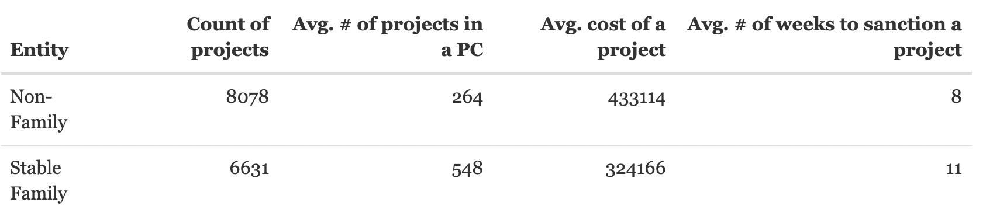
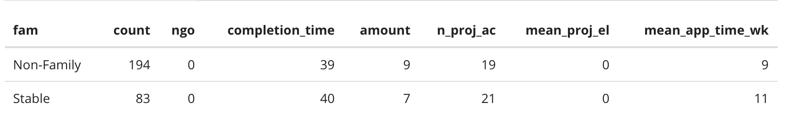
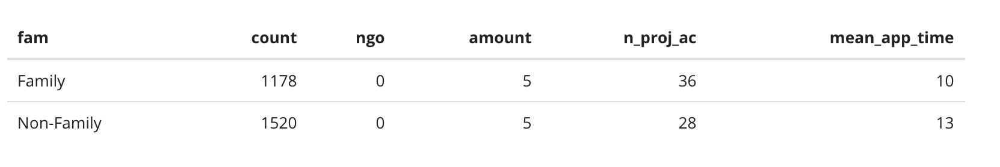
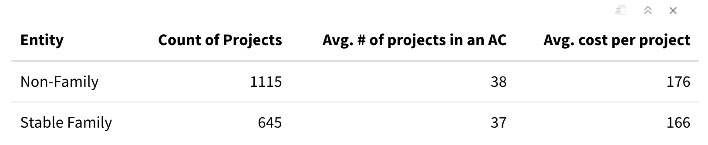
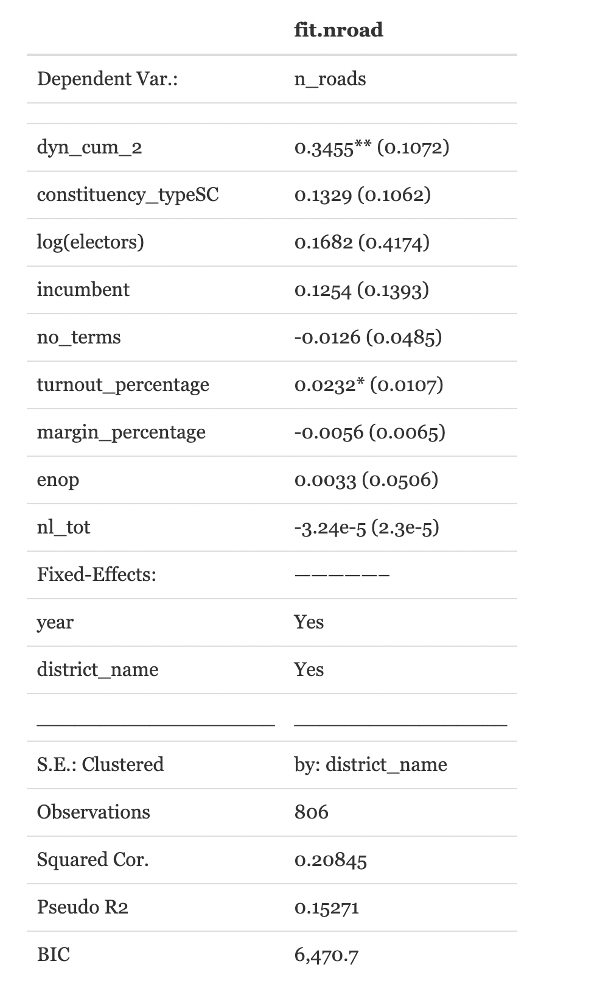
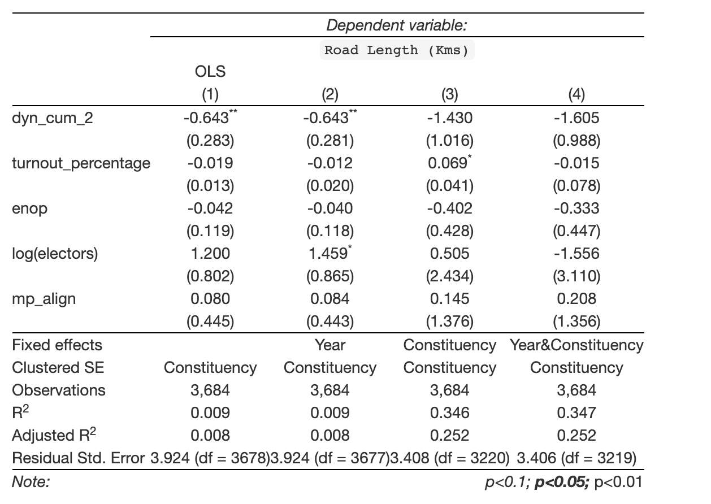
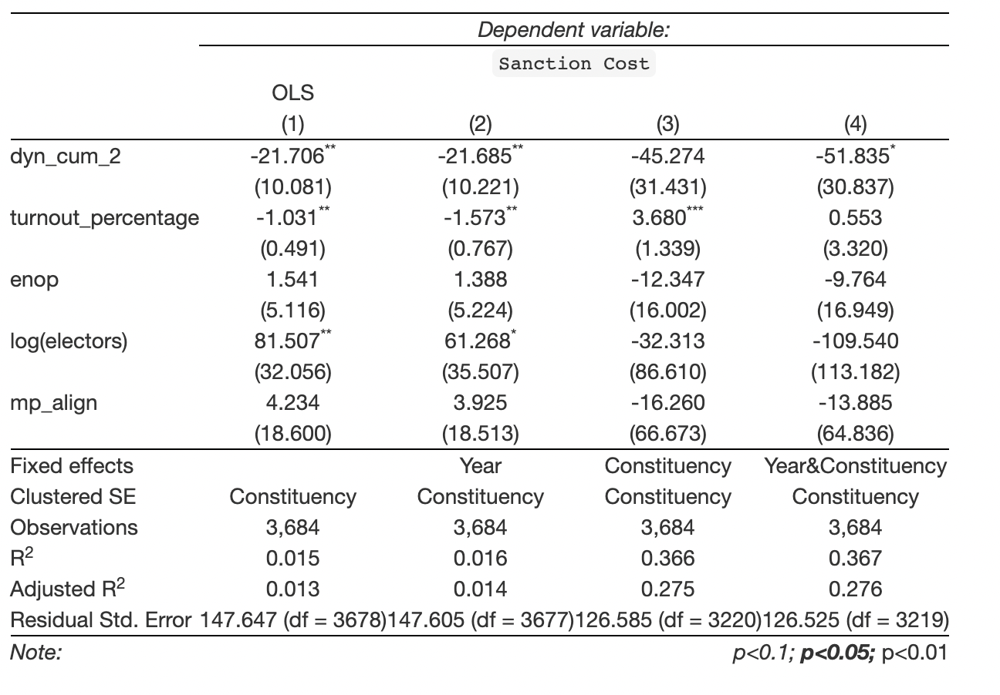

```{r setup, include=FALSE}

knitr::opts_chunk$set(cache = FALSE,echo = FALSE, message=FALSE, warning = FALSE)

options(htmltools.dir.version = FALSE)
knitr::opts_chunk$set(
  fig.width=9, fig.height=3.5, fig.retina=3,
  out.width = "100%",
  cache = FALSE,
  echo = TRUE,
  message = FALSE, 
  warning = FALSE,
  hiline = TRUE
)
```

```{r xaringan-themer, include=FALSE, warning=FALSE}
library(xaringanthemer)
style_mono_accent(
  base_color = "#23395b",
   # fonts
  header_font_google = google_font("Martel", "300", "400"),
  text_font_google = google_font("Lato"),
  code_font_google = google_font("Fira Mono")
)


xaringanExtra::use_xaringan_extra(c("tile_view", "animate_css", "tachyons"))

```


# Outline
```{r xaringan-logo, echo=FALSE}
xaringanExtra::use_logo(
  image_url = "https://upload.wikimedia.org/wikipedia/commons/2/2e/CPR_logo_englishCLR.png",
    width = "200px",
  height = "128px",
)
```


.pull-left[
**Economic consequences**
- MPLADS
- PMGSY
- NREGA
]

.pull-right[
**Political Consequnces**
- Turnout
- Margin

]

---

class: center, middle, inverse

## Economic consequences

---


##MPLADS

--

.pull-left[

### Variables of interest
- Days to sanction

- Cost sanctioned

- Type of the projects
]

--

.pull-right[


### Available datasets

Replication data from
- Bohlken, Anjali Thomas, 2018, “Targeting Ordinary Voters or Political Elites? Why Pork Is Distributed Along Partisan Lines in India.” 

- Velasco Rivera, Carlos, 2019, "Replication Data for: Loyalty or Incentives? How party alignment affects bureaucratic performance"
]

---

.pull-left[
### UP

**MPLADS Carlos**

```{r, out.width="100%",out.height = "50%", echo = FALSE}

```


----

<br>
<br>

**MPLADS Bohlekn**

```{r, out.width = "120%",echo = FALSE}

```

]


--

.pull-right[


### India

**MPLADS Carlos**

```{r,  out.width = "150%", out.height=120,echo = FALSE}

```

- In UP, we observed that Family politicians get delayed sanctions, but when we looked at India, we see the exact opposite.

- We ran models for Both UP and India keeping the `Number of weeks for approval` as the outcome variable. However, in both cases the family dummy variable turned out to be **insignificant** as the model became more rigorous
]


---

# PMGSY

.pull-left[
### Variables of interest

- Sanctioned cost

- Number of roads built

- Road length
]

.pull-right[
### Available datasets

- Data source?
]


---

## UP

.pull-left[

PMGSY 2012 summary

```{r,out.width="100%", echo=FALSE}

```

]

--

.pull-right[
Outcome variable: Number of roads built in a constituency 
```{r,out.width="60%", echo=FALSE}

```
]
---

## PMGSY contd.
.pull-left[
Outcome variable:: Length of the road built
```{r, echo=FALSE}

```

]

--

.pull-right[

Outcome variable: Cost sanctioned for the road

```{r, echo=FALSE}

```
]


---


